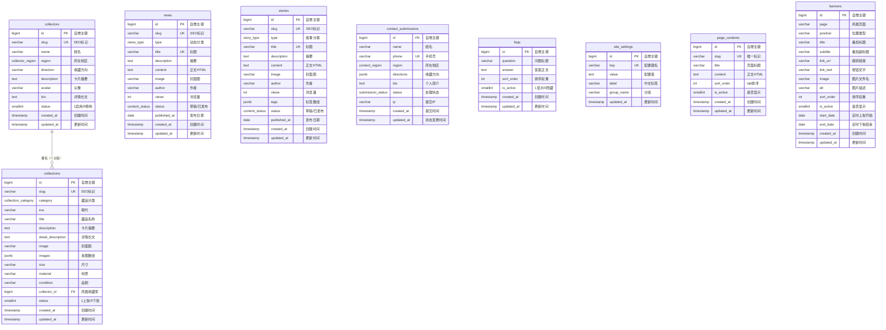

# 胶东私人收藏平台 - 数据库设计文档

> 数据库：PostgreSQL  
> 编写日期：2026-07-19  
> 对应框架：Laravel 13

---

## 一、项目概述

本文档为「胶东私人收藏平台」的完整数据库设计，涵盖藏品展示、收藏家介绍、收藏动态、收藏故事、入驻联系、常见问题、站点配置和页面内容共 8 张核心业务表。

**设计原则：**

- 所有主键使用 `BIGINT` 自增，保证数据量扩展空间
- SEO 友好的 `slug` 字段用于生成可读 URL
- 多值字段（图片数组、标签数组、收藏方向）使用 `JSONB` 类型存储
- 状态字段尽量使用自定义枚举类型（`ENUM`），保证数据一致性
- 软删除统一使用 `status` 字段（0/1），未采用 `deleted_at` 物理删除方案
- 时间字段：`created_at` 必填默认 `NOW()`，`updated_at` 允许 `NULL`（首次创建时为空）

---

## 二、ER 关系说明

### 2.1 关系总览

| 关系 | 类型 | 说明 |
|------|------|------|
| collections.collector_id → collectors.id | 一对多 | 一个收藏家可以拥有多件藏品，一件藏品最多归属一个收藏家 |
| 其余所有表 | 独立 | 无外键关联 |

### 2.2 ER 关系图（Mermaid）



---

## 三、枚举类型定义

在创建表之前，需要先创建以下自定义枚举类型：

```sql
-- 藏品分类
CREATE TYPE collection_category AS ENUM ('瓷器','玉器','书画','钱币','铜器','杂项','文房','织绣','木器');

-- 收藏家所在地区
CREATE TYPE collector_region AS ENUM ('烟台','威海','青岛','潍坊','济南');

-- 收藏动态分类
CREATE TYPE news_type AS ENUM ('展览信息','市场动态','平台采访','行业资讯');

-- 收藏故事分类
CREATE TYPE story_type AS ENUM ('藏品故事','藏家故事');

-- 入驻联系地区
CREATE TYPE contact_region AS ENUM ('烟台','威海','青岛','其他');

-- 入驻联系处理状态
CREATE TYPE submission_status AS ENUM ('pending','approved','rejected');

-- 内容发布状态
CREATE TYPE content_status AS ENUM ('draft','published');
```

---

## 四、数据库表设计

### 4.1 collections（藏品表）

**说明：** 存储平台展示的所有藏品信息，包含基本信息、图片、尺寸材质品相，以及关联的收藏家。

#### 建表语句

```sql
CREATE TABLE collections (
    id                  BIGINT          GENERATED ALWAYS AS IDENTITY PRIMARY KEY,
    slug                VARCHAR(200)    NOT NULL,
    category            collection_category NOT NULL,
    era                 VARCHAR(30)     NOT NULL,
    title               VARCHAR(100)    NOT NULL,
    description         TEXT            NOT NULL,
    detail_description  TEXT            DEFAULT NULL,
    image               VARCHAR(200)    NOT NULL DEFAULT 'default-collection.jpg',
    images              JSONB           NOT NULL DEFAULT '[]'::jsonb,
    size                VARCHAR(100)    NOT NULL,
    material            VARCHAR(50)     DEFAULT NULL,
    condition           VARCHAR(30)     NOT NULL,
    collector_id        BIGINT          DEFAULT NULL REFERENCES collectors(id) ON DELETE SET NULL,
    status              SMALLINT        NOT NULL DEFAULT 1,
    created_at          TIMESTAMP       NOT NULL DEFAULT NOW(),
    updated_at          TIMESTAMP       DEFAULT NULL,

    CONSTRAINT uq_collections_slug UNIQUE (slug)
);

-- 索引
CREATE INDEX idx_collections_collector_id ON collections (collector_id);
CREATE INDEX idx_collections_category ON collections (category);
CREATE INDEX idx_collections_status ON collections (status);
```

#### 字段列表

| 字段 | 类型 | 必填 | 唯一 | 默认值 | 说明 |
|------|------|:----:|:----:|--------|------|
| id | BIGINT | 是 | 是 | AUTO INCREMENT | 主键 |
| slug | VARCHAR(200) | 是 | 是 | - | SEO 友好 URL 标识 |
| category | collection_category | 是 | 否 | - | 藏品分类（枚举） |
| era | VARCHAR(30) | 是 | 否 | - | 朝代 |
| title | VARCHAR(100) | 是 | 否 | - | 藏品名称 |
| description | TEXT | 是 | 否 | - | 卡片摘要 |
| detail_description | TEXT | 否 | 否 | NULL | 详情页长文描述 |
| image | VARCHAR(200) | 是 | 否 | 'default-collection.jpg' | 封面图文件名 |
| images | JSONB | 否 | 否 | '[]' | 详情页多图文件名数组 |
| size | VARCHAR(100) | 是 | 否 | - | 尺寸 |
| material | VARCHAR(50) | 否 | 否 | NULL | 材质 |
| condition | VARCHAR(30) | 是 | 否 | - | 品相 |
| collector_id | BIGINT | 否 | 否 | NULL | 外键 → collectors.id |
| status | SMALLINT | 否 | 否 | 1 | 1 上架 / 0 下架 |
| created_at | TIMESTAMP | 是 | 否 | NOW() | 创建时间 |
| updated_at | TIMESTAMP | 否 | 否 | NULL | 更新时间 |

#### 约束与索引

| 索引/约束名 | 类型 | 字段 | 说明 |
|-------------|------|------|------|
| uq_collections_slug | UNIQUE | slug | 唯一约束 |
| idx_collections_collector_id | INDEX | collector_id | 加速按收藏家查询 |
| idx_collections_category | INDEX | category | 加速按分类筛选 |
| idx_collections_status | INDEX | status | 加速按上下架筛选 |
| fk_collections_collector | FOREIGN KEY | collector_id → collectors.id | 级联置空（删除收藏家后藏品保留，collector_id 置 NULL） |

---

### 4.2 collectors（收藏家表）

**说明：** 存储收藏家基本信息，包含姓名、地区、收藏方向、头像和详细介绍。

#### 建表语句

```sql
CREATE TABLE collectors (
    id          BIGINT          GENERATED ALWAYS AS IDENTITY PRIMARY KEY,
    slug        VARCHAR(100)    NOT NULL,
    name        VARCHAR(50)     NOT NULL,
    region      collector_region NOT NULL,
    direction   VARCHAR(100)    NOT NULL,
    description TEXT            NOT NULL,
    avatar      VARCHAR(200)    NOT NULL DEFAULT 'default-avatar.jpg',
    bio         TEXT            DEFAULT NULL,
    status      SMALLINT        NOT NULL DEFAULT 1,
    created_at  TIMESTAMP       NOT NULL DEFAULT NOW(),
    updated_at  TIMESTAMP       DEFAULT NULL,

    CONSTRAINT uq_collectors_slug UNIQUE (slug)
);

-- 索引
CREATE INDEX idx_collectors_region ON collectors (region);
```

#### 字段列表

| 字段 | 类型 | 必填 | 唯一 | 默认值 | 说明 |
|------|------|:----:|:----:|--------|------|
| id | BIGINT | 是 | 是 | AUTO INCREMENT | 主键 |
| slug | VARCHAR(100) | 是 | 是 | - | SEO 友好 URL 标识 |
| name | VARCHAR(50) | 是 | 否 | - | 姓名 |
| region | collector_region | 是 | 否 | - | 所在地区（枚举） |
| direction | VARCHAR(100) | 是 | 否 | - | 收藏方向 |
| description | TEXT | 是 | 否 | - | 卡片摘要 |
| avatar | VARCHAR(200) | 是 | 否 | 'default-avatar.jpg' | 头像文件名 |
| bio | TEXT | 否 | 否 | NULL | 详情页长文 |
| status | SMALLINT | 否 | 否 | 1 | 1 启用 / 0 停用 |
| created_at | TIMESTAMP | 是 | 否 | NOW() | 创建时间 |
| updated_at | TIMESTAMP | 否 | 否 | NULL | 更新时间 |

#### 约束与索引

| 索引/约束名 | 类型 | 字段 | 说明 |
|-------------|------|------|------|
| uq_collectors_slug | UNIQUE | slug | 唯一约束 |
| idx_collectors_region | INDEX | region | 加速按地区筛选 |

---

### 4.3 news（收藏动态表）

**说明：** 存储平台的收藏动态资讯，包含展览信息、市场动态、平台采访、行业资讯等分类。

#### 建表语句

```sql
CREATE TABLE news (
    id           BIGINT          GENERATED ALWAYS AS IDENTITY PRIMARY KEY,
    slug         VARCHAR(200)    NOT NULL,
    type         news_type       NOT NULL,
    title        VARCHAR(200)    NOT NULL,
    description  TEXT            NOT NULL,
    content      TEXT            NOT NULL,
    image        VARCHAR(200)    NOT NULL DEFAULT 'default-news.jpg',
    author       VARCHAR(100)    NOT NULL DEFAULT '胶东收藏编辑组',
    views        INT             NOT NULL DEFAULT 0,
    status       content_status  NOT NULL DEFAULT 'published',
    published_at DATE            NOT NULL DEFAULT NOW(),
    created_at   TIMESTAMP       NOT NULL DEFAULT NOW(),
    updated_at   TIMESTAMP       DEFAULT NULL,

    CONSTRAINT uq_news_slug UNIQUE (slug),
    CONSTRAINT uq_news_title UNIQUE (title)
);

-- 索引
CREATE INDEX idx_news_type ON news (type);
CREATE INDEX idx_news_status ON news (status);
CREATE INDEX idx_news_published_at ON news (published_at);
```

#### 字段列表

| 字段 | 类型 | 必填 | 唯一 | 默认值 | 说明 |
|------|------|:----:|:----:|--------|------|
| id | BIGINT | 是 | 是 | AUTO INCREMENT | 主键 |
| slug | VARCHAR(200) | 是 | 是 | - | SEO 友好 URL 标识 |
| type | news_type | 是 | 否 | - | 动态分类（枚举） |
| title | VARCHAR(200) | 是 | 是 | - | 标题 |
| description | TEXT | 是 | 否 | - | 摘要 |
| content | TEXT | 是 | 否 | - | 详情页正文 HTML |
| image | VARCHAR(200) | 是 | 否 | 'default-news.jpg' | 封面图文件名 |
| author | VARCHAR(100) | 否 | 否 | '胶东收藏编辑组' | 作者 |
| views | INT | 否 | 否 | 0 | 浏览量 |
| status | content_status | 否 | 否 | 'published' | 草稿 / 已发布 |
| published_at | DATE | 是 | 否 | NOW() | 发布日期 |
| created_at | TIMESTAMP | 是 | 否 | NOW() | 创建时间 |
| updated_at | TIMESTAMP | 否 | 否 | NULL | 更新时间 |

#### 约束与索引

| 索引/约束名 | 类型 | 字段 | 说明 |
|-------------|------|------|------|
| uq_news_slug | UNIQUE | slug | 唯一约束 |
| uq_news_title | UNIQUE | title | 唯一约束 |
| idx_news_type | INDEX | type | 加速按分类筛选 |
| idx_news_status | INDEX | status | 加速按发布状态筛选 |
| idx_news_published_at | INDEX | published_at | 加速按发布日期排序 |

---

### 4.4 stories（收藏故事表）

**说明：** 存储收藏故事类内容，分为「藏品故事」和「藏家故事」两类，支持标签。

#### 建表语句

```sql
CREATE TABLE stories (
    id           BIGINT          GENERATED ALWAYS AS IDENTITY PRIMARY KEY,
    slug         VARCHAR(200)    NOT NULL,
    type         story_type      NOT NULL,
    title        VARCHAR(200)    NOT NULL,
    description  TEXT            NOT NULL,
    content      TEXT            NOT NULL,
    image        VARCHAR(200)    NOT NULL DEFAULT 'default-story.jpg',
    author       VARCHAR(100)    DEFAULT NULL,
    views        INT             NOT NULL DEFAULT 0,
    tags         JSONB           NOT NULL DEFAULT '[]'::jsonb,
    status       content_status  NOT NULL DEFAULT 'published',
    published_at DATE            NOT NULL DEFAULT NOW(),
    created_at   TIMESTAMP       NOT NULL DEFAULT NOW(),
    updated_at   TIMESTAMP       DEFAULT NULL,

    CONSTRAINT uq_stories_slug UNIQUE (slug),
    CONSTRAINT uq_stories_title UNIQUE (title)
);

-- 索引
CREATE INDEX idx_stories_type ON stories (type);
CREATE INDEX idx_stories_status ON stories (status);
CREATE INDEX idx_stories_published_at ON stories (published_at);
```

#### 字段列表

| 字段 | 类型 | 必填 | 唯一 | 默认值 | 说明 |
|------|------|:----:|:----:|--------|------|
| id | BIGINT | 是 | 是 | AUTO INCREMENT | 主键 |
| slug | VARCHAR(200) | 是 | 是 | - | SEO 友好 URL 标识 |
| type | story_type | 是 | 否 | - | 故事分类（枚举） |
| title | VARCHAR(200) | 是 | 是 | - | 标题 |
| description | TEXT | 是 | 否 | - | 摘要 |
| content | TEXT | 是 | 否 | - | 详情页正文 HTML |
| image | VARCHAR(200) | 是 | 否 | 'default-story.jpg' | 封面图文件名 |
| author | VARCHAR(100) | 否 | 否 | NULL | 作者 |
| views | INT | 否 | 否 | 0 | 浏览量 |
| tags | JSONB | 否 | 否 | '[]' | 标签数组 |
| status | content_status | 否 | 否 | 'published' | 草稿 / 已发布 |
| published_at | DATE | 是 | 否 | NOW() | 发布日期 |
| created_at | TIMESTAMP | 是 | 否 | NOW() | 创建时间 |
| updated_at | TIMESTAMP | 否 | 否 | NULL | 更新时间 |

#### 约束与索引

| 索引/约束名 | 类型 | 字段 | 说明 |
|-------------|------|------|------|
| uq_stories_slug | UNIQUE | slug | 唯一约束 |
| uq_stories_title | UNIQUE | title | 唯一约束 |
| idx_stories_type | INDEX | type | 加速按分类筛选 |
| idx_stories_status | INDEX | status | 加速按发布状态筛选 |
| idx_stories_published_at | INDEX | published_at | 加速按发布日期排序 |

---

### 4.5 contact_submissions（入驻联系表）

**说明：** 存储用户提交的入驻申请信息。`phone` 字段设置唯一索引防止 24 小时内重复提交（应用层配合校验）。

#### 建表语句

```sql
CREATE TABLE contact_submissions (
    id          BIGINT              GENERATED ALWAYS AS IDENTITY PRIMARY KEY,
    name        VARCHAR(50)         NOT NULL,
    phone       VARCHAR(20)         NOT NULL,
    region      contact_region      DEFAULT NULL,
    directions  JSONB               NOT NULL DEFAULT '[]'::jsonb,
    bio         TEXT                DEFAULT NULL,
    status      submission_status   NOT NULL DEFAULT 'pending',
    ip          VARCHAR(45)         DEFAULT NULL,
    created_at  TIMESTAMP           NOT NULL DEFAULT NOW(),
    updated_at  TIMESTAMP           DEFAULT NULL,

    CONSTRAINT uq_contact_submissions_phone UNIQUE (phone)
);

-- 索引
CREATE INDEX idx_contact_submissions_status ON contact_submissions (status);
CREATE INDEX idx_contact_submissions_created_at ON contact_submissions (created_at);
```

> **注意：** `phone` 的唯一约束是全表级别的。如需实现「24 小时内防重复，之后允许重新提交」的逻辑，有两种方案：
> 1. **应用层：** Laravel 中在提交前查询 `WHERE phone = ? AND created_at > NOW() - INTERVAL '24 hours'`，存在则拒绝；若不存在但旧记录有 pending/rejected 状态，可复用旧记录或更新。
> 2. **数据库层：** 删除唯一约束，改用 `UNIQUE NULL WHERE` 部分索引（PostgreSQL 支持），允许已过期的记录 phone 重复。此方案较复杂，推荐用应用层方案。

#### 字段列表

| 字段 | 类型 | 必填 | 唯一 | 默认值 | 说明 |
|------|------|:----:|:----:|--------|------|
| id | BIGINT | 是 | 是 | AUTO INCREMENT | 主键 |
| name | VARCHAR(50) | 是 | 否 | - | 姓名，2-20 字符 |
| phone | VARCHAR(20) | 是 | 是 | - | 手机号，11 位（唯一索引防重复） |
| region | contact_region | 否 | 否 | NULL | 所在地区（枚举） |
| directions | JSONB | 否 | 否 | '[]' | 收藏方向多选数组 |
| bio | TEXT | 否 | 否 | NULL | 个人简介 |
| status | submission_status | 否 | 否 | 'pending' | 处理状态（枚举：pending/approved/rejected） |
| ip | VARCHAR(45) | 否 | 否 | NULL | 提交 IP（兼容 IPv6 长度） |
| created_at | TIMESTAMP | 是 | 否 | NOW() | 提交时间 |
| updated_at | TIMESTAMP | 否 | 否 | NULL | 状态变更时间 |

#### 约束与索引

| 索引/约束名 | 类型 | 字段 | 说明 |
|-------------|------|------|------|
| uq_contact_submissions_phone | UNIQUE | phone | 唯一约束，防止同号重复提交 |
| idx_contact_submissions_status | INDEX | status | 加速按处理状态筛选 |
| idx_contact_submissions_created_at | INDEX | created_at | 加速按提交时间排序/查询 |

---

### 4.6 faqs（常见问题表）

**说明：** 存储前台「常见问题」页面的问答内容，支持排序和显示/隐藏控制。

#### 建表语句

```sql
CREATE TABLE faqs (
    id          BIGINT      GENERATED ALWAYS AS IDENTITY PRIMARY KEY,
    question    VARCHAR(200) NOT NULL,
    answer      TEXT        NOT NULL,
    sort_order  INT         NOT NULL DEFAULT 0,
    is_active   SMALLINT    NOT NULL DEFAULT 1,
    created_at  TIMESTAMP   NOT NULL DEFAULT NOW(),
    updated_at  TIMESTAMP   DEFAULT NULL
);

-- 索引
CREATE INDEX idx_faqs_sort_order ON faqs (sort_order);
```

#### 字段列表

| 字段 | 类型 | 必填 | 唯一 | 默认值 | 说明 |
|------|------|:----:|:----:|--------|------|
| id | BIGINT | 是 | 是 | AUTO INCREMENT | 主键 |
| question | VARCHAR(200) | 是 | 否 | - | 问题标题 |
| answer | TEXT | 是 | 否 | - | 答案正文 |
| sort_order | INT | 否 | 否 | 0 | 排序权重，越小越靠前 |
| is_active | SMALLINT | 否 | 否 | 1 | 1 显示 / 0 隐藏 |
| created_at | TIMESTAMP | 是 | 否 | NOW() | 创建时间 |
| updated_at | TIMESTAMP | 否 | 否 | NULL | 更新时间 |

#### 约束与索引

| 索引/约束名 | 类型 | 字段 | 说明 |
|-------------|------|------|------|
| idx_faqs_sort_order | INDEX | sort_order | 加速按排序权重查询 |

---

### 4.7 site_settings（站点配置表）

**说明：** 存储平台全局配置项（如站点名称、联系方式、工作时间等），以键值对形式存储，支持分组管理。

#### 建表语句

```sql
CREATE TABLE site_settings (
    id          BIGINT          GENERATED ALWAYS AS IDENTITY PRIMARY KEY,
    key         VARCHAR(50)     NOT NULL,
    value       TEXT            NOT NULL,
    label       VARCHAR(50)     DEFAULT NULL,
    group_name  VARCHAR(20)     NOT NULL DEFAULT 'general',
    updated_at  TIMESTAMP       DEFAULT NULL,

    CONSTRAINT uq_site_settings_key UNIQUE (key)
);

-- 索引
CREATE INDEX idx_site_settings_group_name ON site_settings (group_name);
```

#### 字段列表

| 字段 | 类型 | 必填 | 唯一 | 默认值 | 说明 |
|------|------|:----:|:----:|--------|------|
| id | BIGINT | 是 | 是 | AUTO INCREMENT | 主键 |
| key | VARCHAR(50) | 是 | 是 | - | 配置键名（唯一） |
| value | TEXT | 是 | 否 | - | 配置值 |
| label | VARCHAR(50) | 否 | 否 | NULL | 后台显示的中文标签 |
| group_name | VARCHAR(20) | 否 | 否 | 'general' | 分组 |
| updated_at | TIMESTAMP | 否 | 否 | NULL | 更新时间 |

#### 约束与索引

| 索引/约束名 | 类型 | 字段 | 说明 |
|-------------|------|------|------|
| uq_site_settings_key | UNIQUE | key | 唯一约束 |
| idx_site_settings_group_name | INDEX | group_name | 加速按分组筛选 |

---

### 4.8 page_contents（页面内容表）

**说明：** 存储平台固定页面内容（如服务介绍、入驻指南、隐私政策、服务条款），支持排序和显示控制。

#### 建表语句

```sql
CREATE TABLE page_contents (
    id          BIGINT          GENERATED ALWAYS AS IDENTITY PRIMARY KEY,
    slug        VARCHAR(50)     NOT NULL,
    title       VARCHAR(100)    NOT NULL,
    content     TEXT            NOT NULL,
    sort_order  INT             NOT NULL DEFAULT 0,
    is_active   SMALLINT        NOT NULL DEFAULT 1,
    created_at  TIMESTAMP       NOT NULL DEFAULT NOW(),
    updated_at  TIMESTAMP       DEFAULT NULL,

    CONSTRAINT uq_page_contents_slug UNIQUE (slug)
);

-- 索引
CREATE INDEX idx_page_contents_sort_order ON page_contents (sort_order);
```

#### 字段列表

| 字段 | 类型 | 必填 | 唯一 | 默认值 | 说明 |
|------|------|:----:|:----:|--------|------|
| id | BIGINT | 是 | 是 | AUTO INCREMENT | 主键 |
| slug | VARCHAR(50) | 是 | 是 | - | 唯一标识，如 privacy-policy |
| title | VARCHAR(100) | 是 | 否 | - | 页面标题 |
| content | TEXT | 是 | 否 | - | 正文 HTML |
| sort_order | INT | 否 | 否 | 0 | tab 排序权重 |
| is_active | SMALLINT | 否 | 否 | 1 | 是否显示 |
| created_at | TIMESTAMP | 是 | 否 | NOW() | 创建时间 |
| updated_at | TIMESTAMP | 否 | 否 | NULL | 更新时间 |

#### 约束与索引

| 索引/约束名 | 类型 | 字段 | 说明 |
|-------------|------|------|------|
| uq_page_contents_slug | UNIQUE | slug | 唯一约束 |
| idx_page_contents_sort_order | INDEX | sort_order | 加速按排序权重查询 |

---

### 4.9 banners（Banner 广告位表）

**说明：** 管理各页面顶部 Banner 和首页 Hero 区的轮播图片，支持叠加文字、跳转链接和定时上下架。

#### 建表语句

```sql
CREATE TABLE banners (
    id          BIGINT          GENERATED ALWAYS AS IDENTITY PRIMARY KEY,
    page        VARCHAR(30)     NOT NULL,
    position    VARCHAR(20)     NOT NULL,
    title       VARCHAR(200)    DEFAULT NULL,
    subtitle    VARCHAR(300)    DEFAULT NULL,
    link_url    VARCHAR(200)    DEFAULT NULL,
    link_text   VARCHAR(50)     DEFAULT NULL,
    image       VARCHAR(200)    NOT NULL,
    alt         VARCHAR(200)    DEFAULT NULL,
    sort_order  INT             NOT NULL DEFAULT 0,
    is_active   SMALLINT        NOT NULL DEFAULT 1,
    start_date  DATE            DEFAULT NULL,
    end_date    DATE            DEFAULT NULL,
    created_at  TIMESTAMP       NOT NULL DEFAULT NOW(),
    updated_at  TIMESTAMP       DEFAULT NULL
);

-- 索引
CREATE INDEX idx_banners_page_position ON banners (page, position);
CREATE INDEX idx_banners_sort_order ON banners (sort_order);
CREATE INDEX idx_banners_active_dates ON banners (is_active, start_date, end_date);
```

#### 字段列表

| 字段 | 类型 | 必填 | 唯一 | 默认值 | 说明 |
|------|------|:----:|:----:|--------|------|
| id | BIGINT | 是 | 是 | AUTO INCREMENT | 主键 |
| page | VARCHAR(30) | 是 | 否 | - | 所属页面：home / collectors / updates / stories |
| position | VARCHAR(20) | 是 | 否 | - | 位置类型：hero（首页Hero区）/ banner（子页面轮播） |
| title | VARCHAR(200) | 否 | 否 | NULL | 叠加标题文字（如"以馆藏方式展示胶东私人藏品"） |
| subtitle | VARCHAR(300) | 否 | 否 | NULL | 叠加副标题/描述文字 |
| link_url | VARCHAR(200) | 否 | 否 | NULL | 点击跳转链接（如 collection.html） |
| link_text | VARCHAR(50) | 否 | 否 | NULL | 按钮文字（如"浏览藏品"） |
| image | VARCHAR(200) | 是 | 否 | - | 图片文件名（不含路径前缀） |
| alt | VARCHAR(200) | 否 | 否 | NULL | 图片无障碍描述 |
| sort_order | INT | 否 | 否 | 0 | 排序权重，越小越靠前 |
| is_active | SMALLINT | 否 | 否 | 1 | 是否显示：1显示 / 0隐藏 |
| start_date | DATE | 否 | 否 | NULL | 定时上架开始日期（NULL表示不限制） |
| end_date | DATE | 否 | 否 | NULL | 定时下架结束日期（NULL表示不限制） |
| created_at | TIMESTAMP | 是 | 否 | NOW() | 创建时间 |
| updated_at | TIMESTAMP | 否 | 否 | NULL | 更新时间 |

#### 约束与索引

| 索引/约束名 | 类型 | 字段 | 说明 |
|-------------|------|------|------|
| idx_banners_page_position | INDEX | page, position | 加速按页面+位置筛选 |
| idx_banners_sort_order | INDEX | sort_order | 加速排序 |
| idx_banners_active_dates | INDEX | is_active, start_date, end_date | 加速定时上下架查询 |

#### page + position 取值说明

| page | position | 说明 |
|------|----------|------|
| home | hero | 首页 Hero 区（通常 1 张） |
| collectors | banner | 收藏家页顶部轮播（多张，按 sort_order 排列） |
| updates | banner | 收藏动态页顶部轮播 |
| stories | banner | 收藏故事页顶部轮播 |

> **注意：** `update-detail.html` 和 `story-detail.html` 的 Hero 图不需要此表管理，直接使用 `news` / `stories` 表的 `image` 字段即可。

---

## 五、初始种子数据

### 5.1 site_settings 预设数据

```sql
INSERT INTO site_settings (key, value, label, group_name, updated_at) VALUES
    ('site_name',    '胶东私人收藏平台',               '站点名称',   'contact', NOW()),
    ('site_email',   'contact@jiaodong-collection.com', '联系邮箱',   'contact', NOW()),
    ('site_address', '山东省烟台市芝罘区',              '联系地址',   'contact', NOW()),
    ('site_work_hours', '周一至周五 9:00-17:00',       '工作时间',   'contact', NOW());
```

### 5.2 page_contents 预设数据

```sql
INSERT INTO page_contents (slug, title, content, sort_order, is_active, created_at, updated_at) VALUES
    ('service-intro',     '服务介绍', '<p>服务介绍内容待填写</p>',     1, 1, NOW(), NULL),
    ('join-guide',         '入驻指南', '<p>入驻指南内容待填写</p>',     2, 1, NOW(), NULL),
    ('privacy-policy',     '隐私政策', '<p>隐私政策内容待填写</p>',     3, 1, NOW(), NULL),
    ('terms-of-service',   '服务条款', '<p>服务条款内容待填写</p>',     4, 1, NOW(), NULL);
```

### 5.3 banners 预设数据

```sql
INSERT INTO banners (page, position, title, subtitle, link_url, link_text, image, alt, sort_order, is_active, created_at, updated_at) VALUES
    ('home',      'hero',   '以馆藏方式展示胶东私人藏品', '胶东地区私人藏品信息展示平台，提供收藏家之间的联系渠道。', 'collection.html', '浏览藏品', 'hero-collection-display.jpg', '藏品展示', 1, 1, NOW(), NULL),
    ('collectors','banner', '以藏会友：胶东收藏家群落',   '汇聚胶东地区热爱收藏的民间藏家，共同分享收藏心得',   NULL, NULL, 'banner-collectors-1.jpg', '收藏家交流', 1, 1, NOW(), NULL),
    ('collectors','banner', '文人雅趣：文房清供与供石',   '品味传统文人的雅致生活，感受文房清供的魅力',         NULL, NULL, 'banner-collectors-2.jpg', '文房清供',   2, 1, NOW(), NULL),
    ('updates',   'banner', '古玩集市热闹开市',           '古玩集市热闹开市',                                           NULL, NULL, 'banner-updates-1.jpg',    '古玩市场',   1, 1, NOW(), NULL),
    ('updates',   'banner', '皇家丝绸织物特展启幕',       '皇家丝绸织物特展启幕',                                       NULL, NULL, 'banner-updates-2.jpg',    '丝绸织物展览', 2, 1, NOW(), NULL),
    ('stories',   'banner', '方寸之间的历史：邮票收藏的故事', '一枚枚老邮票，承载着百年岁月的记忆',                 NULL, NULL, 'banner-story-1.jpg',     '青花瓷器收藏', 1, 1, NOW(), NULL),
    ('stories',   'banner', '掌中乾坤：鼻烟壶与微型雕刻',   '掌中乾坤：鼻烟壶与微型雕刻',                               NULL, NULL, 'banner-story-2.jpg',     '鼻烟壶收藏',  2, 1, NOW(), NULL);
```

---

## 六、Laravel Migration 备注

### 6.1 Model 对应关系

| 数据库表 | Laravel Model | 说明 |
|----------|---------------|------|
| collections | `App\Models\Collection` | 藏品 |
| collectors | `App\Models\Collector` | 收藏家 |
| news | `App\Models\News` | 收藏动态 |
| stories | `App\Models\Story` | 收藏故事 |
| contact_submissions | `App\Models\ContactSubmission` | 入驻联系 |
| faqs | `App\Models\Faq` | 常见问题 |
| site_settings | `App\Models\SiteSetting` | 站点配置 |
| page_contents | `App\Models\PageContent` | 页面内容 |
| banners | `App\Models\Banner` | Banner广告位 |

### 6.2 关键实现要点

**slug 自动生成：**
在 Laravel Model 的 `creating` 事件中，使用 `Str::slug()` 自动生成 slug：

```php
// 在对应 Model 的 boot 方法中
protected static function booted(): void
{
    static::creating(function ($model) {
        if (empty($model->slug)) {
            $model->slug = Str::slug($model->title ?? $model->name, '-');
        }
    });
}
```

**收藏家-藏品关联关系：**
在 `Collector` Model 中定义一对多关联：

```php
// Collector Model
public function collections(): HasMany
{
    return $this->hasMany(Collection::class);
}
```

藏品数量通过动态查询获取，不冗余存储：

```php
$collectionCount = Collection::where('collector_id', $collector->id)->count();
```

**入驻联系防重复提交：**
`contact_submissions.phone` 已设置数据库层唯一索引。应用层需额外检查 24 小时内的重复提交：

```php
// ContactSubmissionController@store
$exists = ContactSubmission::where('phone', $request->phone)
    ->where('created_at', '>', now()->subDay())
    ->exists();

if ($exists) {
    return back()->withErrors(['phone' => '该手机号 24 小时内已提交过申请，请勿重复提交。']);
}
```

**图片路径处理：**
数据库中仅存储文件名，路径前缀由前端和后端各自拼接：

```php
// 后端拼接示例
$fullUrl = Storage::url('collections/' . $collection->image);

// 前端拼接示例
image) }}" />
```

### 6.3 Migration 执行顺序注意事项

由于 `collections` 表的 `collector_id` 外键依赖 `collectors` 表，Migration 文件的执行顺序应为：

1. 先创建 `collectors` 表
2. 再创建 `collections` 表
3. 其余表无依赖，可任意顺序创建

PostgreSQL 枚举类型的创建需要在对应表之前完成。在 Laravel Migration 中，枚举类型可通过 `DB::statement()` 创建：

```php
// 在 Schema::create 之前执行
DB::statement("CREATE TYPE collection_category AS ENUM ('瓷器','玉器','书画','钱币','铜器','杂项','文房','织绣','木器');");
```

或使用 Laravel 13 推荐的 `Schema::createEnumType()` 方法（如果可用）。
